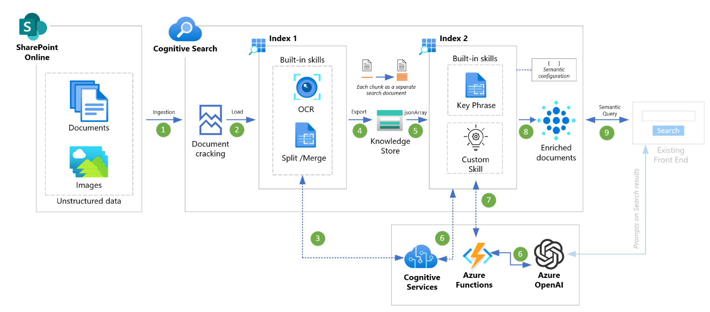
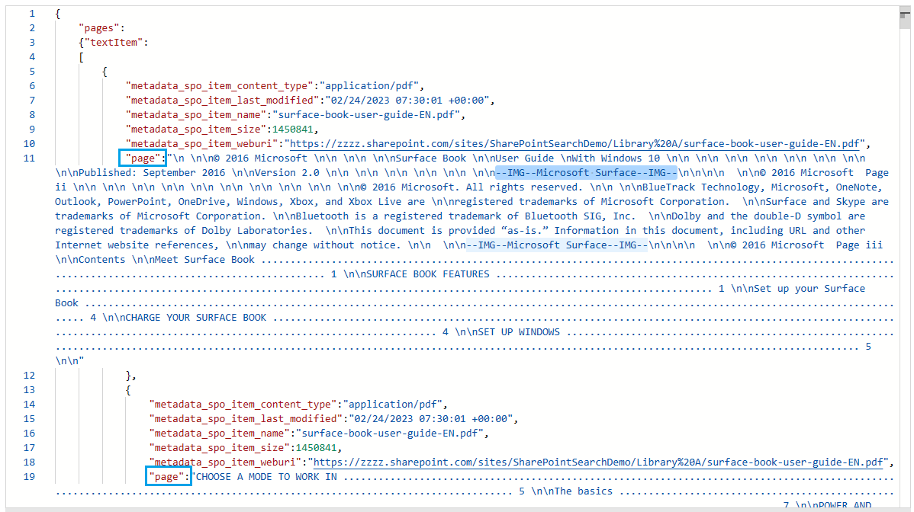

# Azure Cognitive Semantic Search | Large documents | OpenAI enrichment

## About
Azure Cognitive Search offers **Semantic Search** (preview), which uses context and meaning to enhance search results. This includes features like semantic re-ranking, captions and highlights, and semantic answers for more relevant and useful search results.Hoever it is challenging to get best Semantic query results on large documents (> 4/5 pages).

The accelerator enhances the results of Semantic queries on large documents by dividing the document into smaller chunks of 4000 characters (which can be customized), and creating a separate search document for each chunk within the search index. This allows the Semantic search engine to process smaller portions of information instead of the entire document, which can be difficult to handle. 

To create multiple search document records within a search index, a two-step process is followed. Firstly, the documents are ingested into index 1 and the OCR skill is applied to extract text from images in the document. Then, the document is exported to an Azure Storage knowledgestore as a jsonArray as shown in example below.

In the second step, the exported jsonArray is ingested into a new search index 2, with each array item serving as a separate search document!

The search index is enhanced through the implementation of **OpenAI Prompt** custom skill, which is achieved via an Azure Function. The chunking of document provides advantage of retriving only the a portion of the larger document as part of query results, which then can be utilised for interactive follow-up prompts by the end user.

This accelerator utilizes the SharePoint Online (preview) connector to ingest data from SharePoint online. Additionally, it can function with other Cognitive Search supported data sources, including Azure Storage. This will require some alterations to both index definitions.

## Features
- **Improved** Semantic Search on large documents.
- **OpenAI** integration through custom skill.
- **SharePoint** Online ingestion.
- Built-in **AI skills**: OCR, Entity Recognition, Key Phrase Extraction, etc.

## Azure Services
- Azure Cognitive Search service (Pricing tier: Standard).
- General-purpose Azure Storage account that supports Blobs, Queue, and Table storage for Azure Functions and as index 1 export.
- Function App (Python 3.9, Consumption plan type).
- Cognitive services multi-service account.
- Azure OpenAI service (with appropriate text-NNN-NNN model deployed).

## How to deploy?
1. Provision necessary Azure services
2. [Deploy Azure Function *](md/AzureFunction.md)
3. Create Cognitive Search artefacts
    - [Azure AAD Service Pricipal](https://learn.microsoft.com/en-us/azure/search/search-howto-index-sharepoint-online#step-3-create-an-azure-ad-application) (skip step #9)
    - [Create datasource, indexes, skillsets, indexers etc. *](md/Postman.md)
    - [Enable Semantic Search](https://learn.microsoft.com/en-us/azure/search/semantic-search-overview#enable-semantic-search)

     
    * Code included in this repo.

## Keys usage

*Postman / POST requests*
- Cognitive Search admin key
- Cognitive Services multi-service account key
- Azure Storage Account connection string (includes key)
- Azure Function Key

*Azure Function*
- Azure OpenAI service key

## Looking for OpenAI + Redis Semantic Search Demo?
- [Azure OpenAI Semantic Search Demo | with Document Upload via UI](https://github.com/MaheshSQL/openai-vector-search-demo)

## Other important information
- The connection to SharePoint online (in this setup) uses Device Code authentication.
- [SharePoint Indexer (Preview)](https://learn.microsoft.com/en-us/azure/search/search-howto-index-sharepoint-online)
- [Return Semantic Answers](https://learn.microsoft.com/en-us/azure/search/semantic-answers?tabs=semanticConfiguration)
- Development Tools: VS Code, [Postman](https://www.postman.com/downloads/).