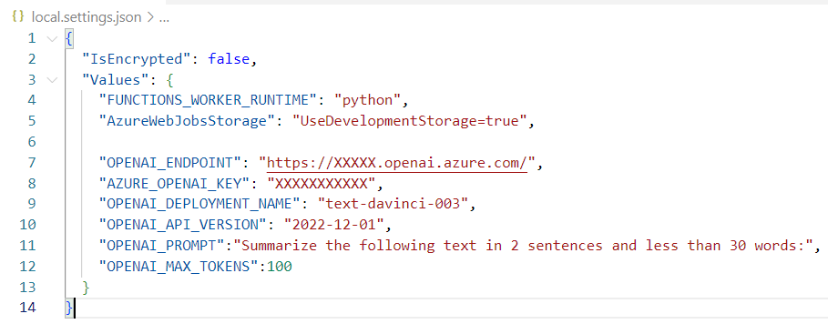

## Deploy Azure Function
- [Python Azure Function](https://learn.microsoft.com/en-us/azure/azure-functions/create-first-function-cli-python?tabs=azure-cli%2Cbash&pivots=python-mode-configuration)
- For local testing / after deployment, configure / add below app settings

