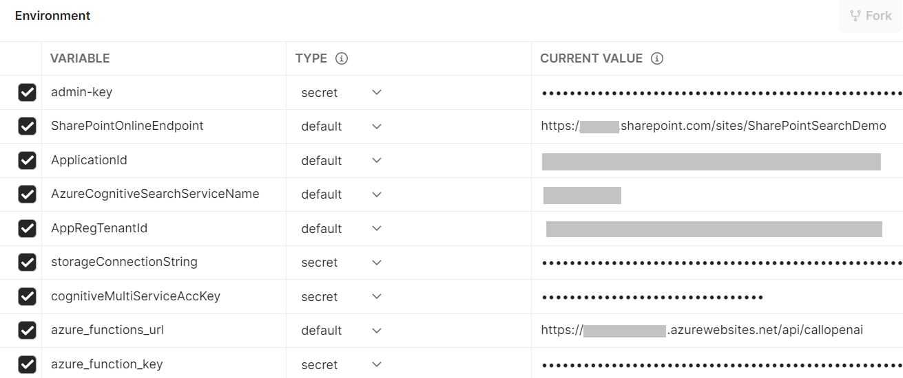
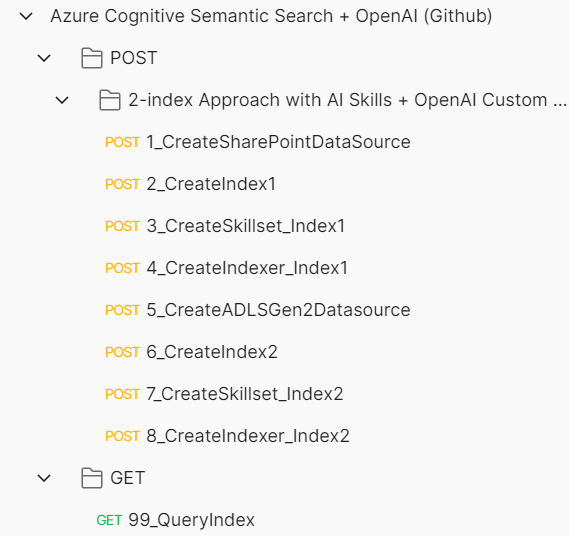

## Setting up Postman Environment Variables
- Import the postman script from repo into Postman.
- Create a new Environment in Postman.
- Add these variables and have them assigned correct values.
- Remember, the first indexer will require Device code authentication. Once you authenticate, re-run the first indexer create script. The Service Principal tenant must allow Device code authentication, otherwise the first indexer will not succeed.
 

 

## Postman Requests
- Run them in the given order. 
- These will create the data sources, indexes, indexers, semantic configuration and skillsets.
 

